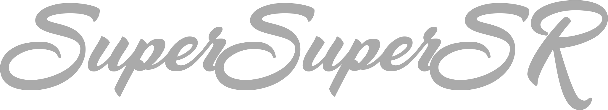

<div align="center"></div>


**SuperSuperSR** is a FastAPI-based image super-resolution API that provides a simple and extensible interface for running deep learning super-resolution models. 

---

## Currently Supported Models

* ✅ SRCNN (Super-Resolution Convolutional Neural Network)

> More super-resolution models will be added in future releases.


---

## ▶️ Running the API

Create and activate a virtual environment:

```bash
python -m venv .venv
source .venv/bin/activate
```

Install the required packages:

```bash
pip install -r requirements.txt
```

Run the from the project root:

```bash
uvicorn main:app --reload
```

---


